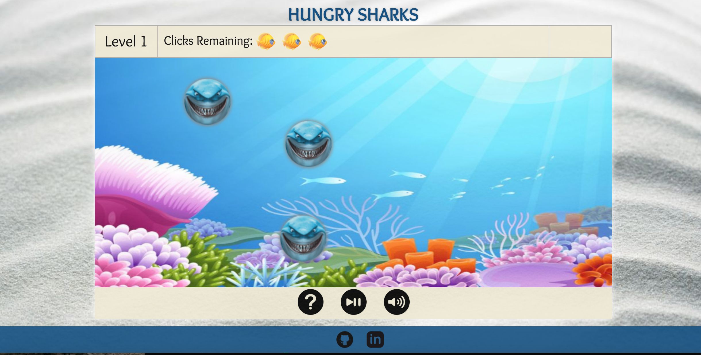

## Hungry Sharks

### Background

Hungry Sharks is a brain game designed to increase the users divided attention, or ability to multitask. Identical sharks swim around the screen in random directions and are fed by clicking on them. The user must wait three seconds in between clicks. There will be a timer to let the user know when they can feed a shark again and a the fed shark will temporarily glow green when it has been successfully fed. Each shark must be fed only once to move on the next level. In order to be successful, the user must stayed focused on which sharks they have already fed and which ones they have not. If they click on the same shark twice, the round is lost. With each level, another shark is added. The fist round has one, the second has two, and so on.

### Functionality & MVP

Users will be able to:

- [ ] Start and pause the game and mute the music
- [ ] Sharks swim around randomly and do not leave the frame
- [ ] If a player tries to feed the same shark twice, the round is lost. If the player feeds them all once, the player moves on to the next round.
- [ ] There is a timer that counts down to when the player can successfully feed sharks and feeding is disabled until the timer back to zero

In addition, this project will include:

- [ ] An About modal describing how to play the game and its rules
- [ ] A production Readme

### Wireframes

This app will have a single screen with the game board, game statistics, game controls, and nav links to my Github and LinkedIn. The game statistics will include a label for the current round, the timer, an 'About' modal, and the number of fish left to feed the sharks. The game controls will include play and pause buttons and a button to toggle the sound off or on. As a bonus, I will add speed controls.

### Architecture and Technologies
This project will be implemented with the following technologies:

- JavaScript and `jquery` for game logic,
- `Easel.js` with `HTML5 Canvas` for DOM manipulation and rendering,
- Webpack to bundle and serve up the scripts.

In addition to the webpack entry file, this project will have the following scripts:

`game_view.js`: Stores the Game instance and the canvas context.

`game.js`:  Keeps track of the current round and winning or losing. Holds the collection of sharks and keeps them in the dimensions of the space. Responsible for moving the objects and drawing the game.. 

`utils.js`: Handles vector math.

`moving_object.js`: Parent class for things that move.

`shark.js`: Inherits from moving_object. Will have an attribute to keep track of if it is fed. Will have the methods like changing colors when clicked and toggling fed.

### Implementation Timeline

**Day 1**: Setup all modules,get webpack up and running, and install `Easel.js`.  Create `webpack.config.js` and `package.json`. Re-learn how vectors work. Learn how to use the `Easel.js` API. Goals for the day:

- A successful `webpack` bundle.
- Render the background to the `Canvas` element.
- Working links to my Github and LinkedIn.
- A working About modal that renders a description of how to play the game and rules.

**Day 2**: Complete the Utils, MovingObject and Shark modules. Use the GameView to render them. Goals for the day:

- Sharks are 'swimming' through the screen randomly.
- Sharks stay within bounds.

**Day 3**: Complete the Game and Round modules. Goals for the day:

- Sharks should be clickable.
- The timer works correctly with clicks.
- The number of sharks increases by one when all current sharks have been clicked.
- The player loses and game resets when it clicks the same shark twice.

**Day 4**: Add the controls, statistics info, and About modal. Add CSS to make it look polished. Goals for the day:

- There are controls for pause and play.
- The number of fish are displayed and decrease with every successful click.
- On entering the next round, text will flash alerting the player and the label for the round number will change.
- Sound can be turned on or off.

### Bonus features

- [ ] Add other distractions swimming around the screen such as other fish, octopus, turtles, etc.
- [ ] Add an option to change the speed in which the sharks swim
